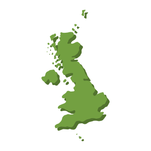

# Convert GeoJSON to SVG

This package takes a polygon-only GeoJSON (such as country or state boundaries) and exports each polygon to SVG. It re-projects each polygon using `proj4js` to a localized Azimuthal Equidistant projection based on the centroid of each polygon and exports to it's own GeoJSON.

## Example Output


## Installation
```
npm install
```

## Configuration
Set the input file here:  
```
var geoJson = require('./input/Admin_0_Polygons.json')
```

Set the output directory here:  
```
var dir = './output';
```

Set the style of the SVG here:
```
attributes: {
  'fill': "#52732E",
  'id': name,
  "transform": "translate(5,5)"
}
```
The style is currently configured to have two SVG `<path>` with different styles. The first set of attributes is the background (offset) style, and the foreground is set here:
```
options.attributes.transform = "translate(0,0)";
options.attributes.id = "offset";
options.attributes.fill = "#73A041"
```

The projection is set in `function createDefString`

## Running

`node index.js`

Included is "Moriarty Hand" Admin 0 polygons from [Project Linework](http://www.projectlinework.org) to use as an example.
